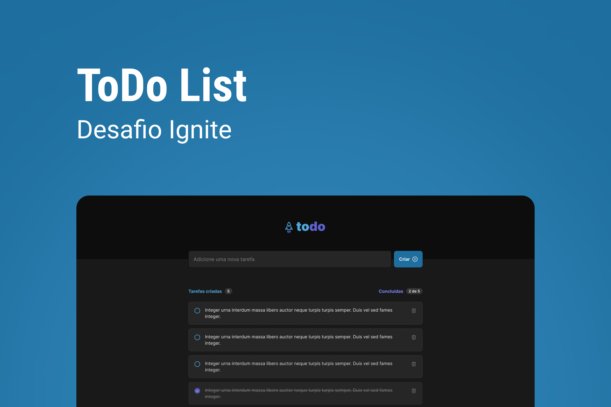
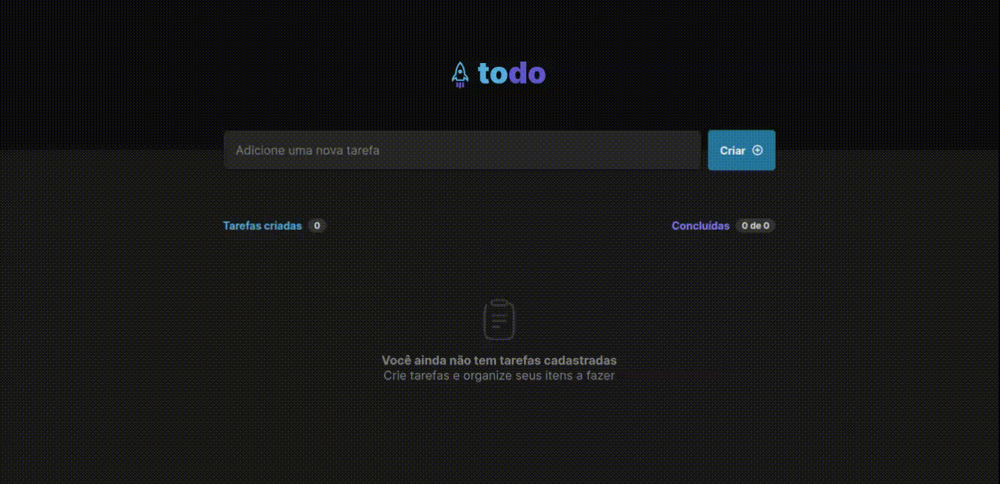

<h1 align="center">
  ToDo List
</h1>

<div>
  
</div>

<p align="center">
  Projeto desenvolvido a partir de um desafio do curso de ReactJS do programação de especialização (Ignite) da
  <a target="_blank" href="https://www.rocketseat.com.br/">Rocketseat</a>
</p>

<p align="center">
 <a href="#sobre">Sobre o Projeto</a> •
 <a href="#funcionalidades">Funcionalidades</a> • 
 <a href="#pre-requisitos">Pré-requisitos</a> • 
 <a href="#como-executar">Como executar</a> • 
 <a href="#tecnologias">Tecnologias</a> • 
 <a href="#autor">Autor</a> • 
 <a href="#licenca">Licença</a> • 
</p>

<h4 align="center"> 
	✅ Projeto Finalizado ✅
</h4>

---

<div>
  
</div>

<h2 id="sobre">💻️ Sobre o projeto</h2>
Essa é uma aplicação construída como parte do curso de ReactJS do programa Ignite da Rocketseat, o projeto foi desenvolvido do total zero, apenas sendo fornecido o design e a ideia por parte do curso

---

<h2 id="funcionalidades">⚙️ Funcionalidades</h2>

- [X] Cadastro de novas tarefas
- [X] Listagem de tarefas criadas
- [X] Exibição do número total de tarefas
- [X] Exibição do progresso de tarefas feitas
- [X] Marcar/Desmarcar tarefa como concluída
- [X] Excluir tarefa previamente criada


---

<h2 id="pre-requisitos">🟢 Pré-requisitos</h2>

Antes de começar, você vai precisar ter instalado em sua máquina as seguintes ferramentas:
[Git](https://git-scm.com) e [Node.js](https://nodejs.org/en/).
Além disto é bom ter um editor para trabalhar com o código como [VSCode](https://code.visualstudio.com/)

<h2 id="como-executar">🚀 Como Executar o projeto</h2>

```bash
# Clone este repositório
$ git clone git@github com:jose-uilton-ferreira/ToDo-List.git

# Acesse a pasta do projeto no terminal/cmd
$ cd Todo-List

# Instale as dependências
$ npm install

# Execute a aplicação em modo de desenvolvimento
$ npm run dev

# O servidor inciará na porta:3000 - acesse <http://localhost:3000>
```

---

<h2 id="tecnologias">🛠 Tecnologias</h2>

As seguintes ferramentas foram usadas na construção do projeto:

- [React](https://pt-br.reactjs.org/)
- [Typescript](https://www.typescriptlang.org/)
- [Vite](https://vitejs.dev/)

---

<h2 id="autor">🦸 Autor</h2>

<a href="https://www.linkedin.com/in/jos%C3%A9-uilton-ferreira-de-siqueira-399158198/">
 
 <br />
 <sub><b>José Uilton</b></sub>
 </a>


Feito com ❤️ por José Uilton 👋 Entre em contato!

[](https://twitter.com/UiltonSiqueira) [](https://www.linkedin.com/in/jos%C3%A9-uilton-ferreira-de-siqueira-399158198/) 
[](mailto:programasuilton@gmail.com)

---

<h2 id="licenca">📝 Licença</h2>
Este projeto foi feito sobe a licença <a href="https://github.com/jose-uilton-ferreira/desafio02-trilha-reactjs/blob/main/LICENSE">MIT</a>.

